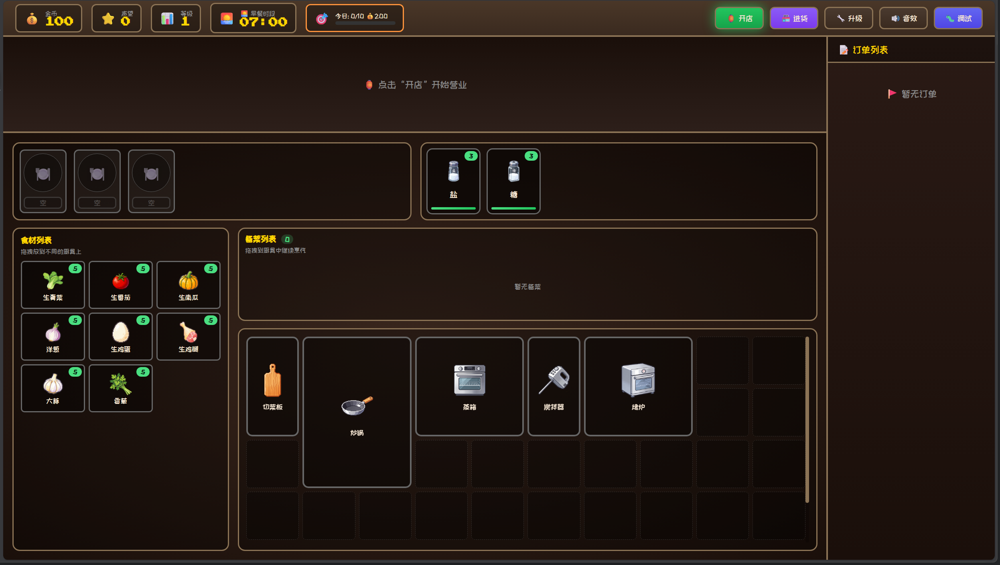

# 🍜 中华料理传奇 Chinese Cuisine Legend

<p align="center">
  
</p>

<p align="center">
  <strong>一款基于 Vue 3 的中式烹饪模拟游戏</strong>
</p>

<p align="center">
  <a href="#游戏截图">截图</a> •
  <a href="#游戏特色">特色</a> •
  <a href="#快速开始">开始</a> •
  <a href="#技术栈">技术栈</a>
</p>

---

## 🎮 游戏简介

《中华料理传奇》是一款模拟经营类烹饪游戏。玩家经营一家中式餐厅，通过切菜、炒菜、蒸煮等多种烹饪方式制作美味佳肴，满足不同顾客的需求，赚取金币并不断升级自己的厨房！

## ✨ 游戏特色

### 🍳 真实的烹饪系统
- **多种厨具**：砧板、炒锅、蒸笼、烤架、搅拌机
- **食材处理**：切菜、炒制、蒸煮、烤制、搅拌
- **组合烹饪**：将备菜组合成美味佳肴
- **烧糊系统**：菜品完成后需及时取出，否则会烧糊

### 🎲 随机事件系统
- **内部事件**：厨具损坏、食材掉落、盘子摔碎、调料撒了
- **厨具专属事件**：锅翻了、锅铲坏了、蒸箱爆炸、搅拌器抽风、烤炉自焚
- **外部事件**：小偷、乞丐、卫生检查员、美食评论家、名人来访、供应商
- **被动事件**：虫子吃食材、老鼠来访、短暂停电
- **难度倍率**：随天数增加事件概率

### 👨‍🍳 多样化的顾客
- **普通顾客**：基础小费
- **美食家**：要求更高，小费更丰厚
- **美食评论家**：挑剔的味觉，高额小费
- **老顾客**：志心耒耐，稳定小费

### 🍲 丰富的菜品
- **蒸菜**：蒸南瓜、蒸鸡腿
- **炒菜**：蒸鸡腿、番茄炒蛋
- **凉菜**：凉拌黄瓜、凉拌洋葱
- **等等...

### 💰 经营系统
- **日夜循环**：早餐、午餐、晚餐时段
- **金币系统**：赚取金币购买食材和升级
- **声望系统**：提升声望解锁更多内容
- **连击系统**：连续完美上菜获取额外奖励

### 🔧 调试工具
- **顾客控制**：开关顾客生成、手动生成顾客
- **事件概率**：实时调整各种随机事件的触发概率
- **难度倍率**：调整不同难度等级的事件倍率
- **菜品生成**：快速生成指定菜品用于测试

### 🎯 拖放操作
- 拖放食材到厨具
- 拖放成品菜到盘子
- 拖放盘子到顾客
- 自由调整厨具布局

## 📷 游戏截图

<p align="center">
  
</p>

## 🚀 快速开始

### 在线体验

访问 [Vercel 部署地址](https://chinese-cooking.vercel.app) 直接开始游戏！

### 本地运行

```bash
# 克隆项目
git clone https://github.com/SuLition/ChineseCooking.git

# 进入目录
cd ChineseCooking

# 安装依赖
pnpm install

# 启动开发服务器
pnpm dev
```

打开浏览器访问 `http://localhost:5173`

## 🛠 技术栈

| 技术 | 说明 |
|------|------|
| **Vue 3** | 渐进式 JavaScript 框架 |
| **Vite** | 下一代前端构建工具 |
| **Composition API** | Vue 3 组合式 API |
| **CSS Grid** | 现代化布局方案 |
| **HTML5 Drag & Drop** | 原生拖放 API |

## 📁 项目结构

```
ChineseCooking/
├── public/              # 静态资源
│   └── images/          # 游戏图片
├── src/
│   ├── assets/          # 样式资源
│   ├── components/      # Vue 组件
│   ├── game/            # 游戏核心逻辑
│   │   ├── composables/ # 组合式函数
│   │   ├── data/        # 游戏数据（食材、菜品、厨具等）
│   │   ├── events/      # 事件系统（内部/外部事件）
│   │   ├── stores/      # 状态管理
│   │   ├── systems/     # 游戏系统（顾客、时间、音效等）
│   │   └── tools/       # 工具函数
│   ├── App.vue          # 主组件
│   └── main.js          # 入口文件
└── package.json
```

## 🎮 操作指南

1. **开店** - 点击“开店”按钮开始营业
2. **接单** - 查看顾客需要的菜品
3. **备菜** - 拖放食材到厨具进行处理
4. **烹饪** - 将备菜组合烹饪成菜品
5. **装盘** - 拖放成品菜到盘子
6. **上菜** - 拖放盘子到顾客完成服务
7. **打烊** - 到点后自动打烊，结算当日收益

## 📝 开发计划

- [x] 随机事件系统
- [x] 调试工具
- [x] 音效系统
- [ ] 更多菜品配方
- [ ] 厨房升级系统
- [ ] 成就系统
- [ ] 移动端适配

## 📄 开源协议

本项目基于 [MIT License](LICENSE) 开源。

---

<p align="center">
  Made with ❤️ by <a href="https://github.com/SuLition">SuLition</a>
</p>
